# prepaLoL
  
## Enoncé
Réaliser une application MAUI avec un MVVM "maison". 
Je vous fournis le modèle, et peut-être quelques vues au fur et à mesure.  
  
J'attends de vous :
- la réalisation d'un toolkit MVVM (bibliothèque de classes),
- le _wrapping_ des classes du modèle par des VM (à chaque fois que c'est nécessaire),
- l'utilisation de commandes pour les différentes fonctionnalités,
- l'utilisation d'une VM _applicative_ (navigation, index, sélection...).

Faites ce que vous pouvez avec, dans l'ordre :
1. l'affichage de la collection de Champions. La possibilité de naviguer de n en n champions (5 champions par page, ou 10, etc.) et la pagination doivent être gérées. 
2. Permettez la sélection d'un champion pour le voir dans une page (on n'utilisera que ses propriétés simples (```Name```, ```Bio```, ```Icon```) puis ```LargeImage```).
3. Ajoutez la gestion des caractéristiques (```Characteristics```).
4. Ajoutez la gestion de la classe du champion.
5. Permettez la modification d'un champion existant (depuis la page du champion, et depuis un swipe sur l'item sélectionné dans la collection).
6. Permettez l'ajout d'un nouveau champion.
7. Ajoutez la gestion des skills.
8. Ajoutez la gestion des skins.

## Captures d'écrans
Quelques captures d'écrans comme attendus :  
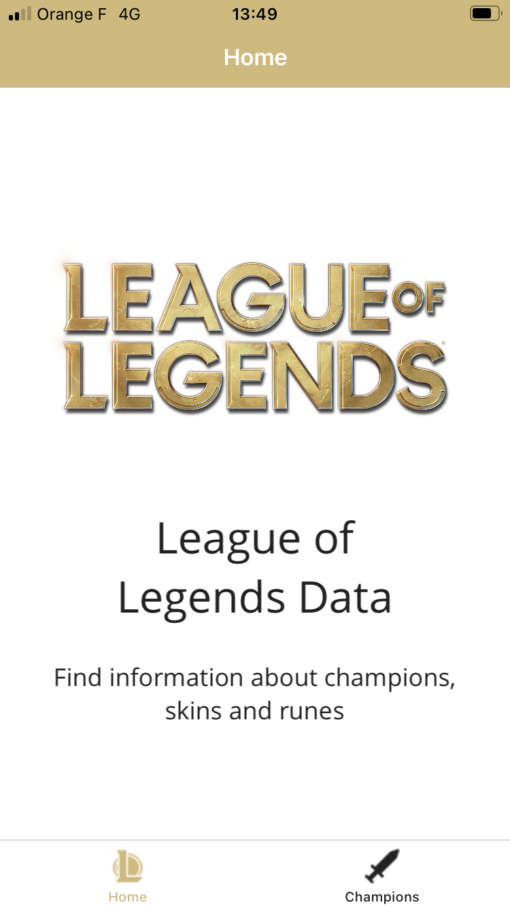
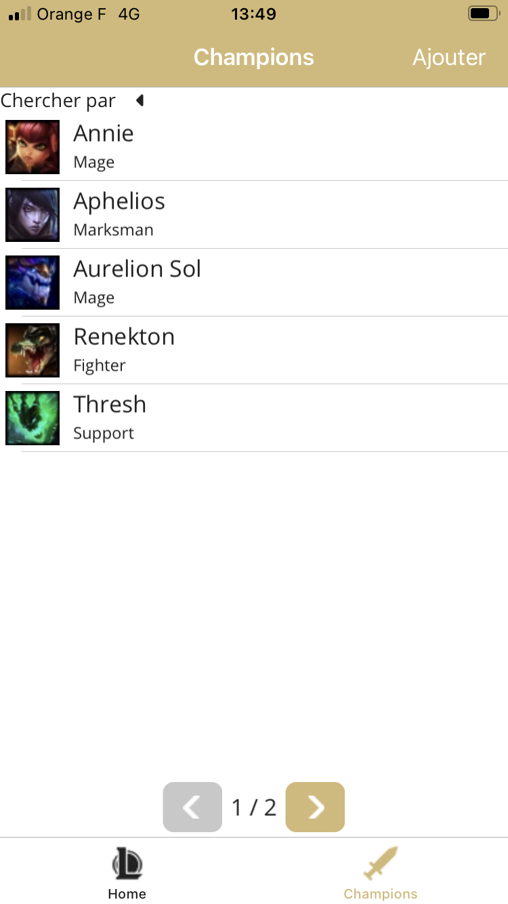
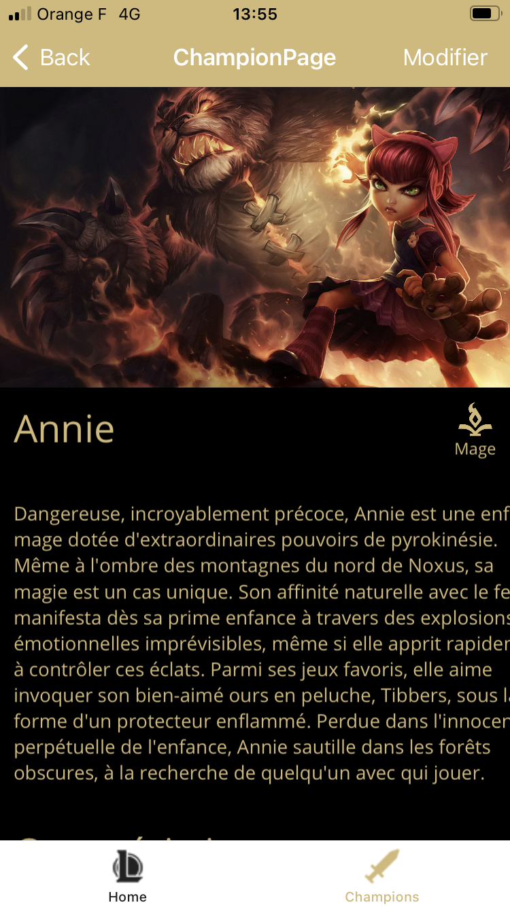
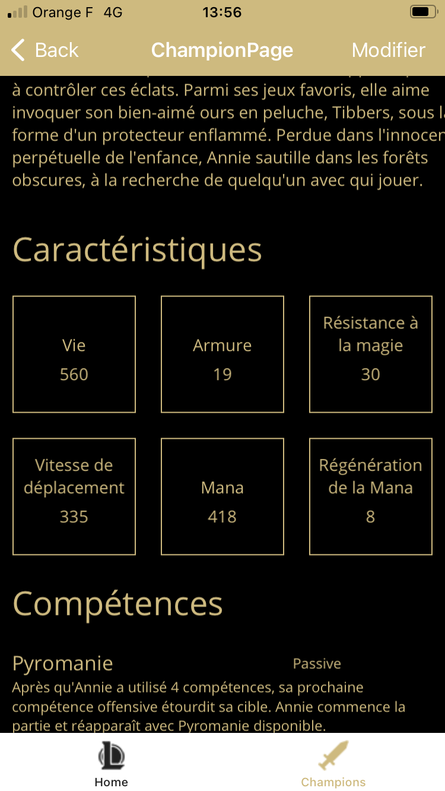
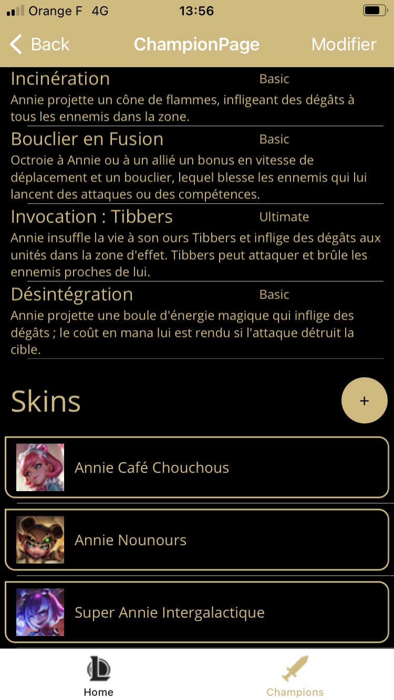
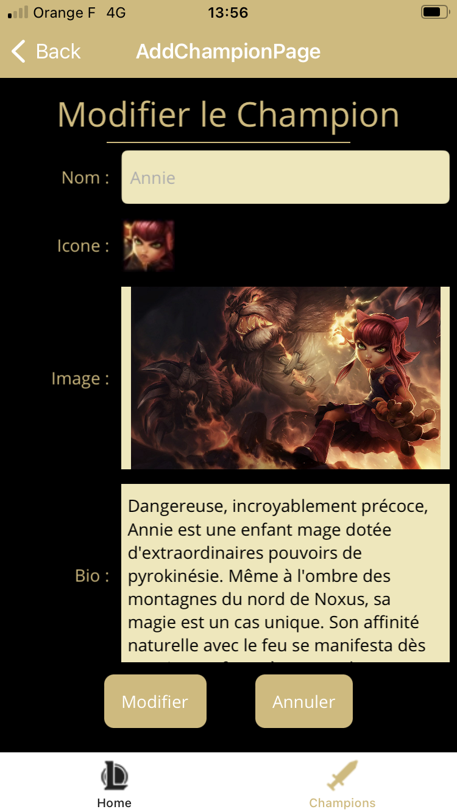
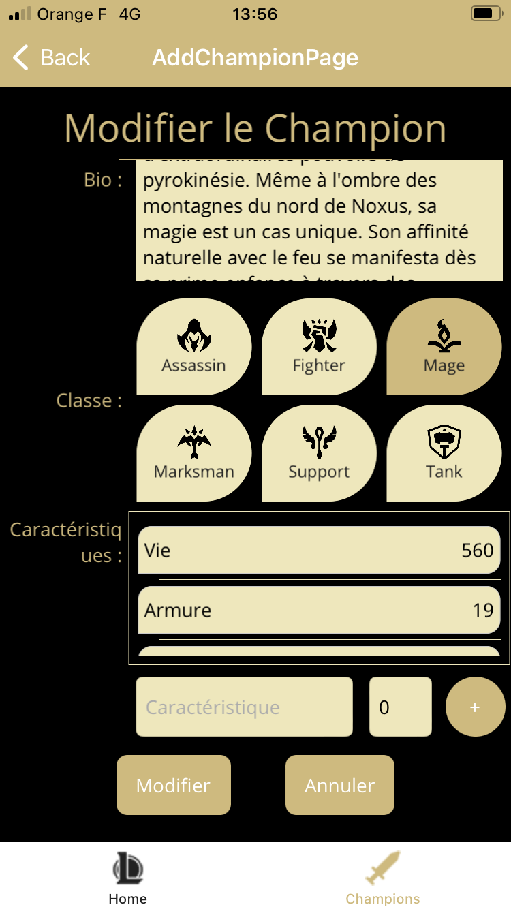
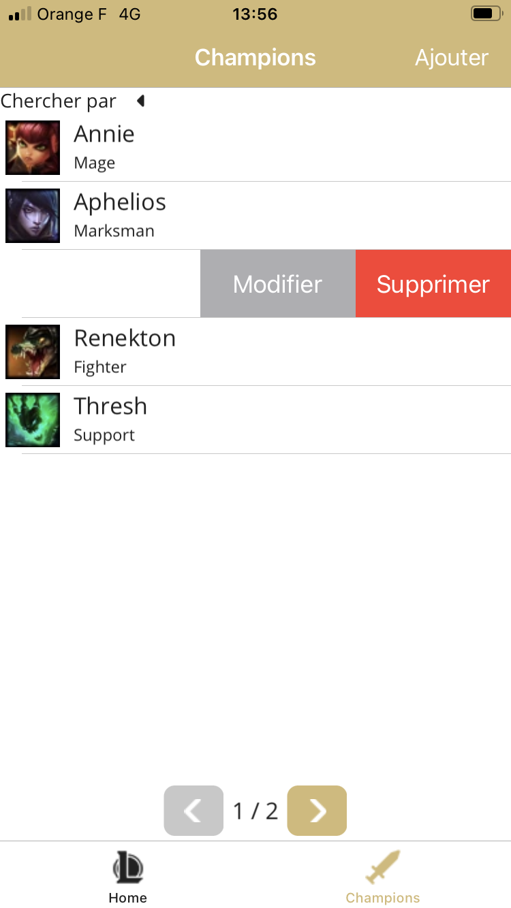
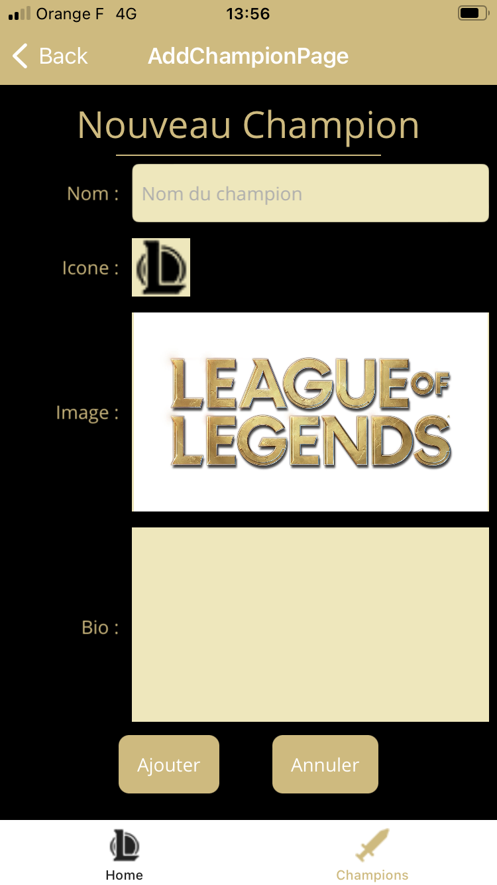

## Diagramme de classes du modèle
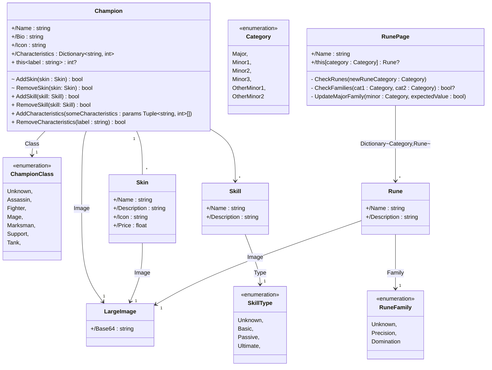

## Diagramme de classes des interfaces de gestion de l'accès aux données
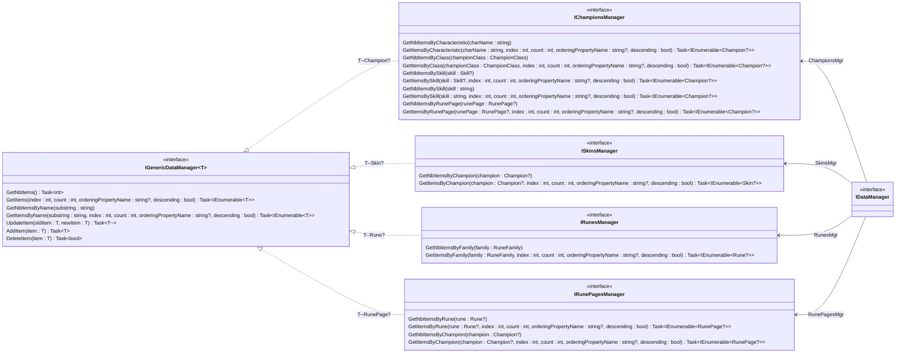

## Diagramme de classes simplifié du Stub
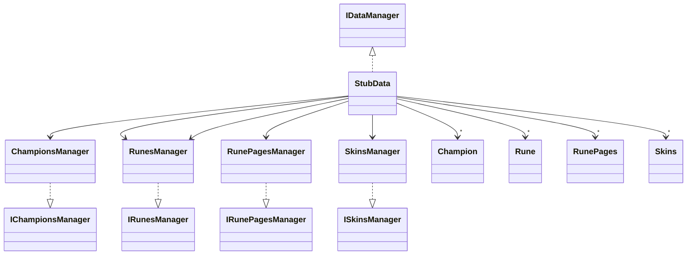